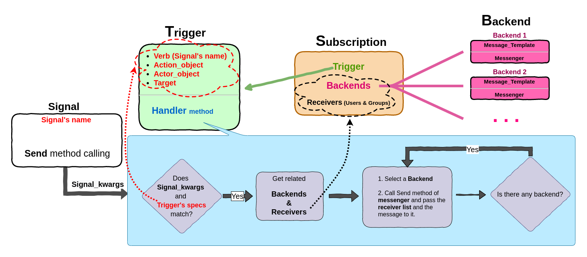

=========================================
Introduction
=========================================

To understand how **DSN** works, We explain some main concepts at first.

.. _Introduction Concepts:

Concepts
========
**DSN** has 3 main parts:

.. _Introduction Concepts Trigger:

* ``Trigger``
    Any Django's signal can be connected to the corresponding trigger. There is a one-to-one connection between each signal and each trigger.

    Calling the signal's **Send** method leads to calling the handler method of the corresponding trigger.

    Trigger has 4 parts(We got the idea from *Activity* concept in a similar package named `Django-activity-stream <https://github.com/justquick/django-activity-stream>`_ ):

    * ``Verb``. The verb phrase that identifies the action of the activity.
    * ``Action Object``. The object linked to the action itself.
    * ``Actor Object``. *(Optional)* The object that performes the activity.
    * ``Target``. *(Optional)* The object to which the activity was performed.

    **Example**: A telegram client can be defined as a Backend for **DSN**.
    We can define a trigger that is connected to ``post_save`` signal and
    one of the project models(*Testmodel* ) set as the action_object.
    So when we create new *Testmodel*, the handler of the corresponding trigger is called automatically
    (The new *Testmodel* could be created by anyone and everywhere Because ``actor_object`` and ``target`` were left empty).

* ``Backend``
    Backend is a tool to send a message like Notification, Email message, or So on that is the primary goal of **DSN**.
    We've got this idea from `django-sitemessage <https://github.com/idlesign/django-sitemessage>`_ ):
    Backend consists of **two** parts:

    1. ``Message_template``. It's a class as a template of the message that contains template string or points to a template file.
    2. ``Messenger``. It's the operational core of each backend that sends the string message (rendered message_template). E.g., Telegram and email Client.

    **Example**: A telegram client can be defined as a Backend for **DSN**.

* ``Subscription``
    Triggers and Backends are connected in a subscription entity.
    Message receivers are set in the subscription, too.

    If the handler method of a trigger is called, the related subscriptions receivers and backends are invoked.
    Then the backends(messenger) are called for each receiver(user). That's the central part of **DSN**.

    **Example**: Same as the above example, A trigger that is connected to the post_save for *Testmodel* is defined.
    Also, we have connected a subscription that set email messenger as the backend and Admin user as the receiver.
    Therefore, If a new *Testmodel* object is created, an email message is sent to the Admin.

    Moreover, We can connect more than one subscription to a trigger. Subscriptions can be switched off.

    .. note::

        Receivers field are just provided in subscription for those situations that the receivers are static(e.g., sending some logs or notifications to Administrator user or group users). Besides, You can send the message to dynamic users(that changed according to the occasions).  For more details refer to :doc:`Dynamic User <dynamic_user>` section.

.. _Introduction Architecture:

Architecture
============

**DSN**'s architecture :

As stated above, **DSN** consists of 3 models(Trigger, Subscription, and Backend).
**DSN** works as follow:
    1. **Setup** and **Initialization** steps:
        1.1. Custom messengers, message_templates, and signals must be defined(*Optional*). It must be done through the code.
        1.2. 3 steps must be done through the admin panel:
            1.2.1. Triggers must be defined by the name of the pre-defined signal(verb_name).

            1.2.2. Required backends must be defined by proper messenger and message_template.

            1.2.3. Subscriptions are the relations between the Trigger and Backends. So, according to the logic of our code, We must select proper backends for a trigger in a subscription.

    2. **Execution**: The code of **DSN** starts when a signal triggers(The send function calling).
        2.1. After the signal triggers, the handler method of the associated trigger is called, and It's check that passed signal arguments match the associated trigger.

        2.2. If everything matches, the associated subscription is evoked, Then a list of backends and receiver users are created.

        2.3. After that, each backend's messengers are called for the specified message and the user.
        (Note: We can set users dynamically. Hence associated user must be defined in the messenger, and the receiver field in the subscription must be left empty)

.. _Introduction Summary:

Summary
=======
    In a nutshell, we can say **DSN** is developed to *send message* :

    * **When and Where** ? : When a Trigger Triggered (The associated signal's send function is called, and the trigger's specs match).
    * **What** to send?: The message that is created to the message_template and other parameters like signal_kwargs.
    * **Whom** to send? : Send the message to the registered receivers in the subscription or the dynamic user that can be specified in the messenger.

.. note::

    It would be best if you took notice of these 3 questions When you want to assign a new trigger to a signal.
